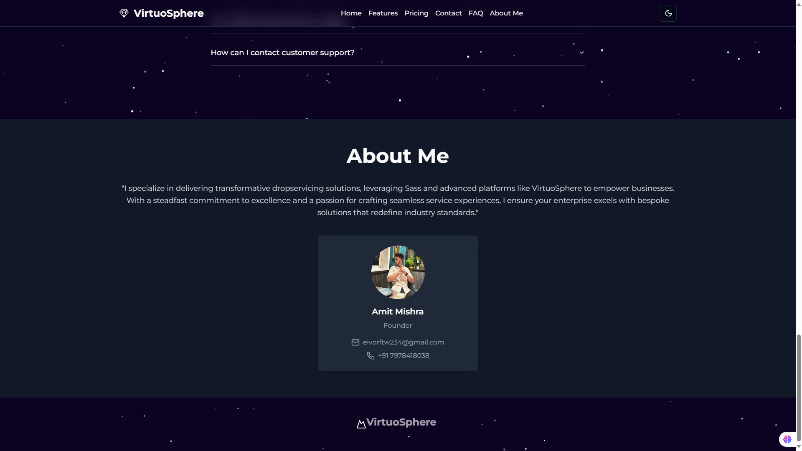

# VirtuoSphere: Sass-Powered Dropservicing Platform

**Redefining Dropservicing**: Elevate your business to new heights with VirtuoSphere, our sleek, Sass-powered platform designed for effortless excellence.

---

## 🚀 Features

- **Sass-Powered Excellence**: Stylish and customizable design to enhance user experience.
- **Effortless Sales Success**: Begin your dropservicing journey with no upfront commitments—no credit card required.
- **Seamless Payment Integration**: Securely manage transactions with Stripe integration.
- **Complete Business Solutions**: An all-in-one platform to handle your dropservicing needs with ease.

---

## 🖼️ Screenshots

### Homepage


### Dashboard


### Payment Integration


### Business Solutions


---

## 🛠️ Tech Stack

- **Frontend**: TypeScript, React.js, Sass
- **Backend**: Node.js
- **Payment Gateway**: Stripe Integration

---

## 🌟 Why VirtuoSphere?

VirtuoSphere simplifies dropservicing with cutting-edge technology, delivering speed, scalability, and exceptional user experience. It's designed to empower your business by offering tools that help you manage operations efficiently and serve your clients effortlessly.

---

## 📄 Installation and Setup

### Prerequisites
Ensure you have the following installed:
- [Node.js](https://nodejs.org/)
- [npm](https://www.npmjs.com/) or [yarn](https://yarnpkg.com/)

### Steps

1. **Clone the repository**:
   ```bash
   git clone https://github.com/yourusername/virtuosphere.git
2: **Navigate to the project directory**:
   ```bash
   cd virtuosphere
